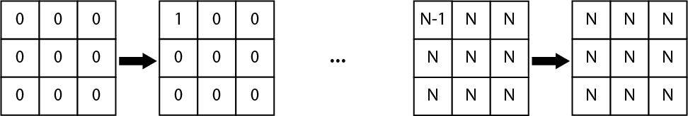
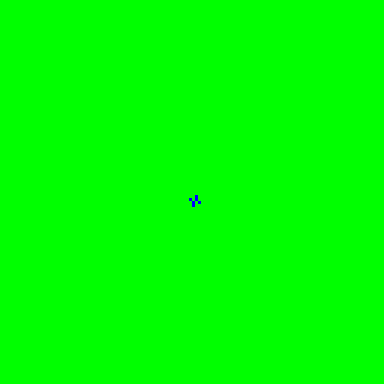

# Evolving structures in complex systems

This repository contains the code to reproduce the Figures and numerical results
from the paper: _Evolving structures in complex systems_ by Hugo Cisneros, Josef
Sivic and Tomas Mikolov.

[Project Slides](https://docs.google.com/presentation/d/1KmJvyKHKAeZvPPUGPVRdSEgyD8vUOoKhJtLZUCVxf7A/edit?usp=sharing)

## Build the C library

The provided C library implements a general cellular automaton simulator and all
the steps for computing the metrics we discuss in the paper.

The library can be built with
```
make all
```

which will create a binary in `bin/automaton`. So far, this has only been tested
on OSX.

### Generate automata

#### Rule file format

Automata rules are encoded in mapping files with the following format: 

Possible transitions are enumerated for a 3x3 neighborhood and `N + 1` (0 to
`N`) states in the way described below, starting from the top-left cell and
incrementing in a row-first manner a __base-N counter__ with __8 cells__.



Mapping files just enumerate the resulting state of the middle cell for the
corresponding neighborhood state. There are  possible 3x3 neighborhoods rules.

#### Obtaining the rule files from the paper

Mapping files with the 3-states rules reported in the paper can be obtained at
the following
[link](https://drive.google.com/uc?id=1fymRRN-Yeig560CkXrLTfpl879YLP_UF&export=download).
The unzipped `maps` directory contains the subdirectories `train` and `test`
that correspond to the training and testing sets used in the paper.

#### Simulating automata

Once the `maps` directory is placed at the root of this directory, running 

```
./scripts/generate_results_from_maps.sh
```

will simulate all automata from the maps and compute the various metrics we
discuss in the paper (this might take a while to complete). The script calls the
executable `bin/automaton` with some options for each `.map` file.

### Compute metrics

After simulating the automata, the metrics are automatically computed. We
compute:

- The compressed length of the automaton state at step 1000.
- The lookup table based metric.
- The neural network based metric.

All metrics are then stored in files for further processing

### Wrapping all this in a script

All the steps described above are also wrapped in a single script that you can
run with the command `./scripts/run_all.sh`.

## Reproduce results from the paper

The results in the paper and values computed to produce those results are in
`data/`, they were computed with a script that you can run with:

```
python3 scripts/compute_results.py
```

Another script extracts results from files generated by the `run_all.sh` script.
You can run it with 
```
python3 scripts/extract_results.py
```

## Visualization tools

Automata evolution can be visualized by generating a GIF image with the script
`generate_frames.sh` in `tools/viz/`. It assigns a set of colors based on the
number of states

For more information about the command, execute 
```
tools/viz/generate_frames.sh -h
```

## Playing with initialization patterns

The library supports specifying a initial pattern for a simulation. Several
example patterns are in `example_patterns/`. 

Patterns can be defined with a specific file format, of which an example is
given below.

```
N=4
R=1685000103177278144
BG=1
#
13231
11111
01110
13231
11111
22022
#
```

The quantity after `N` is the number of states, the one after `R` is the rule
ID. `BG` is an optional value to set all cells not specified in the pattern to a
given state. The pattern itself is delimited by `#` characters, and is just a
rectangle with, for each cell of the pattern, the corresponding state.

When simulating a pattern, one can still choose the size of the automaton, the
number of steps, etc. The patterns will be centered in the middle of the
automaton for easier visualization.

As an example, the following command that uses the spaceship pattern above, with
the four states rule `1685000103177278144`
```bash
tools/viz/generate_frames.sh -n 4 \
                             -t 300 \
                             -g 1 \
                             -d 5 \
                             -j example_patterns/spaceships_4.pat \
                             -s 32 \
                             1685000103177278144
```
produces the following GIF at `./rule_gif/temp.gif`:


Another example:
```bash
tools/viz/generate_frames.sh -n 3 -g 10 -t 2000 -d 10 -s 128 \
                               -j example_patterns/exploding_3.pat \
                               16855021099980290151
```
It produces


